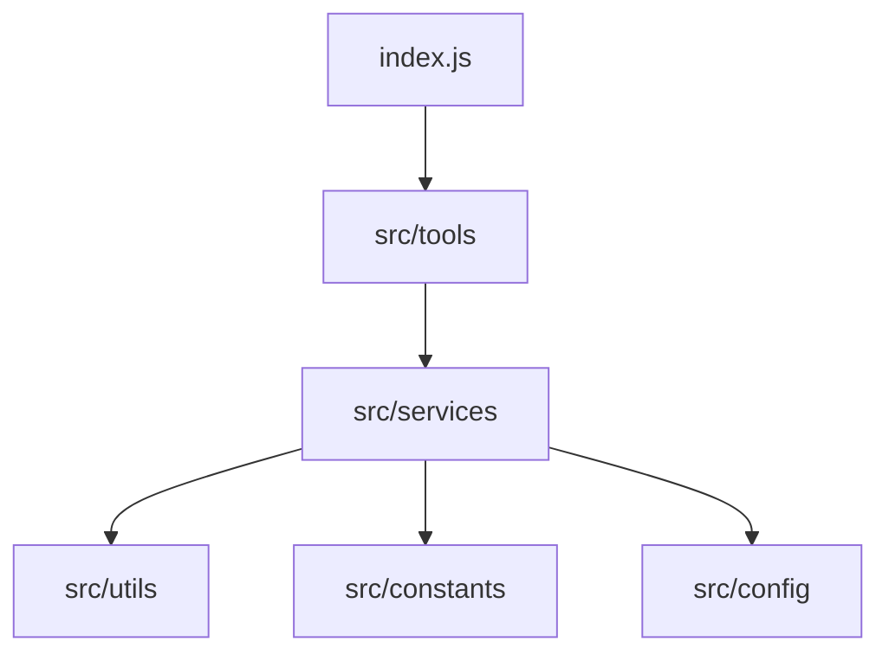

# Figma MCP Server

An MCP server for the Figma REST API, allowing AI models to interact with Figma files, projects, components, styles, webhooks, and variables.

## Overview

This server provides a comprehensive set of tools to interact with Figma's REST API v1. It follows a modular, layered architecture:

- **Config Layer**: Manages configuration and environment variables.
- **Constants Layer**: Defines API endpoints, error messages, and tool schemas.
- **Services Layer**: Handles communication with the Figma API using axios.
- **Tools Layer**: Registers tools with the MCP server and links them to services.
- **Utils Layer**: Provides logging, error handling, and response formatting.

## Getting Started

### Prerequisites

- Node.js (v18 or higher)
- A Figma Personal Access Token

### Setup

1. Clone the repository and navigate to the `figma` directory.
2. Install dependencies:
   ```bash
   npm install
   ```
3. Create a `.env` file based on `.env.example`:
   ```bash
   cp .env.example .env
   ```
4. Add your Figma Personal Access Token to the `.env` file:
   ```
   FIGMA_ACCESS_TOKEN=your_token_here
   ```

### Running the Server

To start the server using Stdio transport:
```bash
npm start
```

## Available Tools

The server provides tools in the following categories:

- **Files**: Get file content, nodes, images, image fills, and versions.
- **Comments**: List, post, and delete comments.
- **Users**: Get information about the authenticated user.
- **Projects**: List team projects and project files.
- **Components**: List file/team components and component sets, get specific components.
- **Styles**: List file/team styles, get specific styles.
- **Webhooks**: Create, get, update, delete, and list team webhooks.
- **Variables**: Get local/published variables, create/update variables.

For a detailed list of all tools and their parameters, see [FIGMA_TOOLS_REFERENCE.md](./FIGMA_TOOLS_REFERENCE.md).

## Architecture



## Logging

Logs are stored in the `logs/` directory. By default, it uses daily rotation for `combined.log` and `error.log`.

## Development

- **Linting**: `npm run lint`
- **Verification**: Ensure your `FIGMA_ACCESS_TOKEN` is set before testing tools.

## License

MIT
